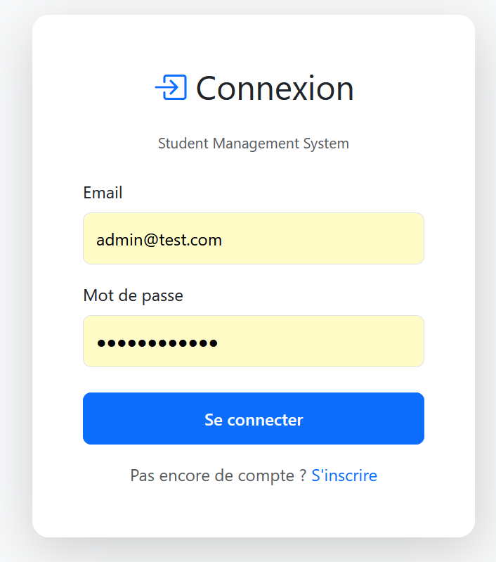
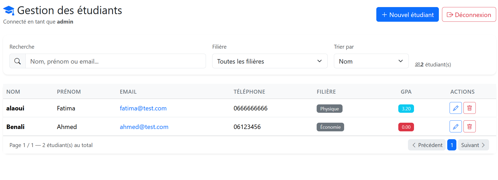

#  Student Management System — Full Stack

Application complète de gestion des étudiants avec authentification JWT.


---

## Aperçu

###  Page de connexion


###  Gestion des étudiants


###  API REST (Swagger)


---

##  Stack technique

### Backend
| Technologie | Rôle |
|-------------|------|
| **ASP.NET Core 9** | Framework Web API |
| **Entity Framework Core** | ORM / Accès données |
| **PostgreSQL 18** | Base de données |
| **JWT** | Authentification |
| **BCrypt.Net** | Hashage mots de passe |
| **Swagger** | Documentation API |

### Frontend
| Technologie | Rôle |
|-------------|------|
| **Angular 19** | Framework SPA |
| **Bootstrap 5** | UI / Design responsive |
| **TypeScript** | Typage fort |
| **RxJS** | Programmation réactive |

---

##  Installation

### Prérequis
- .NET 9 SDK
- Node.js 20+
- PostgreSQL 18

###  Backend

```bash
cd StudentManagement.API
dotnet restore
dotnet ef database update
dotnet run
API disponible sur : http://localhost:5084
cd student-management-frontend
npm install
ng serve
App disponible sur : http://localhost:4200
Fonctionnalités
✅ Inscription / Connexion (JWT)

✅ Créer un étudiant

✅ Modifier un étudiant

✅ Supprimer un étudiant

✅ Recherche (nom, prénom, email)

✅ Filtre par filière

✅ Tri (nom, GPA, date, filière)

✅ Pagination (10 par page)

✅ Interface responsive

🔐 Sécurité
Mots de passe hashés avec BCrypt

Authentification JWT

Interceptor HTTP (token automatique)

Guard sur les routes /students

CORS configuré pour Angular

📡 Endpoints API
Méthode	Route	Auth	Description
POST	/api/Auth/register	❌	Inscription
POST	/api/Auth/login	❌	Connexion
GET	/api/Students	✅	Liste (recherche/tri/pagination)
POST	/api/Students	✅	Créer
GET	/api/Students/{id}	✅	Détails
PUT	/api/Students/{id}	✅	Modifier
DELETE	/api/Students/{id}	✅	Supprimer
🔍 Paramètres de recherche
text
GET /api/Students?search=ahmed&major=Informatique&sortBy=gpa&page=1&pageSize=10
Paramètre	Valeurs	Description
search	string	Nom, prénom ou email
major	string	Filière exacte
sortBy	name, gpa, enrollment, major	Champ de tri
page	int	Numéro de page (défaut : 1)
pageSize	int	Éléments par page (défaut : 10, max : 100)
🗄️ Modèle de données
User
Id (Guid)

Username (string)

Email (string, unique)

PasswordHash (string)

CreatedAt (DateTime)

Student
Id (Guid)

FirstName (string)

LastName (string)

Email (string, unique)

Phone (string)

DateOfBirth (DateTime)

Address (string)

Major (string)

GPA (decimal 3,2)

EnrollmentDate (DateTime)

CreatedAt, UpdatedAt (DateTime)

📁 Structure
text
student-management/
├── StudentManagement.API/              # Backend .NET
│   ├── Controllers/                     # AuthController, StudentsController
│   ├── Data/                            # AppDbContext
│   ├── Models/
│   │   ├── DTOs/                       # Objets de transfert
│   │   └── Entities/                   # User, Student
│   ├── Services/                        # AuthService, StudentService, TokenService
│   ├── Migrations/
│   └── Program.cs
│
├── student-management-frontend/         # Frontend Angular
│   └── src/app/
│       ├── core/
│       │   ├── guards/                 # AuthGuard
│       │   ├── interceptors/           # JwtInterceptor
│       │   ├── models/                 # Student, User
│       │   └── services/               # AuthService, StudentService
│       └── features/
│           ├── auth/                    # Login, Register
│           └── students/               # Student List, Student Form
│
└── docs/                                # Captures d'écran


